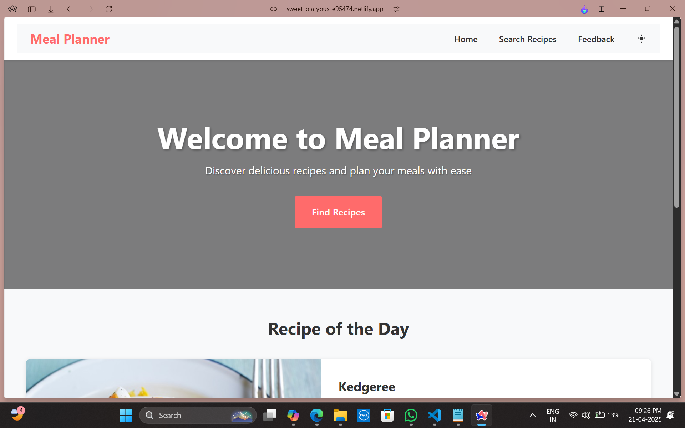

# 🍽️ Meal Planner

A modern, responsive web application for discovering, saving, and planning your meals. Built with React, Vite, and the MealDB API.



## ✨ Features

- **Recipe Search**
  - Search for recipes by name
  - Filter by cuisine and category
  - Responsive grid layout with lazy-loaded images
  - Beautiful animations and transitions

- **Recipe Details**
  - Detailed recipe information
  - Step-by-step cooking instructions
  - Ingredient list with measurements
  - Video tutorials (when available)
  - Interactive UI with hover effects

- **Modern UI/UX**
  - Dark/Light theme support
  - Responsive design for all devices
  - Smooth animations and transitions
  - Loading states and error handling
  - Beautiful typography and layout

- **User Experience**
  - Feedback form for user suggestions
  - Easy navigation between pages
  - Quick access to recipe details
  - Mobile-friendly interface

## 🚀 Getting Started

### Prerequisites

- Node.js (v14 or higher)
- npm (v6 or higher)

### Installation

1. Clone the repository:
```bash
git clone https://github.com/mr-panther01/meal-planner.git
cd meal-planner
```

2. Install dependencies:
```bash
npm install
```

3. Start the development server:
```bash
npm run dev
```

4. Open your browser and visit:
```
http://localhost:5173
```

## 🛠️ Built With

- [React](https://reactjs.org/) - JavaScript library for building user interfaces
- [Vite](https://vitejs.dev/) - Next Generation Frontend Tooling
- [MealDB API](https://www.themealdb.com/) - Free recipe API
- [React Router](https://reactrouter.com/) - Declarative routing for React
- [Axios](https://axios-http.com/) - Promise based HTTP client

## 📱 Responsive Design

The application is fully responsive and works on:
- Desktop computers
- Tablets
- Mobile phones

## 🎨 Theme Support

- Light theme (default)
- Dark theme
- Smooth theme transitions
- System preference detection

## 🔍 Search Features

- Real-time search
- Category filtering
- Cuisine filtering
- Recipe meta information
- Lazy-loaded images

## 📝 Recipe Details

- High-quality recipe images
- Detailed ingredient lists
- Step-by-step instructions
- Video tutorials
- Interactive UI elements

## 🤝 Contributing

Contributions are welcome! Please feel free to submit a Pull Request.

## 📄 License

This project is licensed under the MIT License - see the [LICENSE](LICENSE) file for details.

## 🙏 Acknowledgments

- [The MealDB](https://www.themealdb.com/) for providing the recipe API
- [React](https://reactjs.org/) team for the amazing framework
- [Vite](https://vitejs.dev/) team for the excellent build tool

## 📞 Support

If you encounter any issues or have suggestions, please open an issue on GitHub or use the feedback form in the application.

---

Made with ❤️ by [Your Name]
